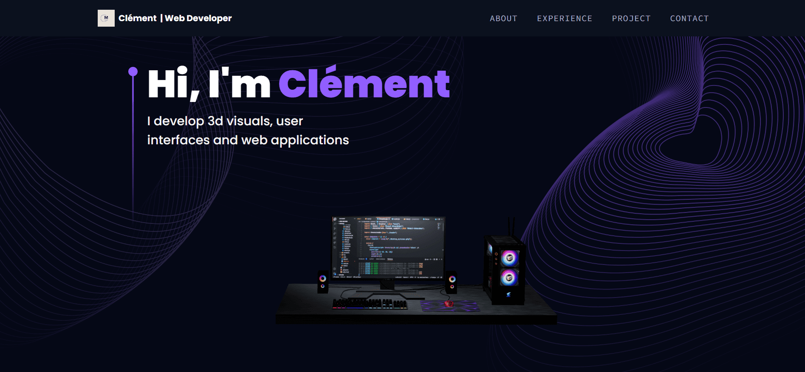

<div align="center">
 
  <h3 align="center">Portfolio 3D</h3>
</div>

## <br /> 📋 <a name="table">Summary</a>

- ✨ [Introduction](#introduction)
- 🛠 [Technology Used](#tech-stack)
- 🚀 [Launch App](#launch-app)
- 🎨 [Styling](#style)

## <br /> <a name="introduction">✨ Introduction</a>

This portfolio is a showcase of my skills, built with React and styled with TailwindCSS.

- I leveraged Three.js to create a dynamic and interactive experience for my portfolio website.
- Building dynamic and interactive web applications using React.js and other related technologies.
- Implementing responsive design to ensure seamless user experience across all devices.
- Guaranteeing cross-browser compatibility to make my applications accessible on various browsers.
- My portfolio features a functional contact form powered by EmailJS, making it easy for visitors to get in touch.

## <br /> <a name="tech-stack">🛠 Technology Used</a>

- [TailwindCSS](https://tailwindcss.com/docs/installation)

- [react-router-dom](https://www.npmjs.com/package/react-router-dom)
The react-router-dom package contains bindings for using React Router in web applications. Please see the Getting Started guide for more information on how to get started with React Router.
  
- [React-Three-Fiber](https://docs.pmnd.rs/react-three-fiber/getting-started/introduction)
React-three-fiber is a React renderer for three.js. Build your scene declaratively with re-usable, self-contained components that react to state, are readily interactive and can participate in React's ecosystem.

- [react-three/drei](https://www.npmjs.com/package/@react-three/drei/v/9.0.1)
A growing collection of useful helpers and fully functional, ready-made abstractions for @react-three/fiber.

- [react-tilt](https://www.npmjs.com/package/react-tilt?activeTab=readme)
A tiny request Animation Frame powered 60 fps light weight parallax hover tilt effect for ReactJS.

- [react-vertical-timeline-component](https://www.npmjs.com/package/react-vertical-timeline-component)
Create visually appealing and interactive vertical timelines for your web applications. It provides pre-built components for representing timeline elements, including dates, icons, content areas, and connectors.

- [react-router-dom](https://www.npmjs.com/package/react-router-dom)
The react-router-dom package contains bindings for using React Router in web applications. Please see the Getting Started guide for more information on how to get started with React Router.

- [maath](https://www.npmjs.com/package/maath)

- [framer-motion](https://www.npmjs.com/package/framer-motion)
Framer Motion is an open source, production-ready library that’s designed for all creative developers.

- [@emailjs/browser](https://www.emailjs.com/docs/sdk/installation/)
send emails, html and attachments (files, streams and strings) from node.js to any smtp server


## <br /> <a name="launch-app">🚀 Launch App</a>

<br/>**Cloning the Repository**

```bash
git clone {git remote URL}
```

<br/>**installation**

> After cloning the repository, run the command `npm install` to install the project's dependencies.

> Once the dependencies are installed, start the project with the command `npm run dev`.

## <br /> <a name="launch-app">🎨 Styling</a>

Global styling are defined using TailwindCSS in the tailwind.config.js file.

````
theme: {
    extend: {
      colors: {
        main: "#0B111E",
        secondary: "#aaa6c3",
        tertiary: "#151030",
        "black-100": "#100d25",
        "black-200": "#090325",
        "white-100": "#f3f3f3",
        cp: "#915eff",
        bracket: '#ADA8C3',
        // tag project 
        gray: '#434343',
        black: '#000000',
        cyan: '#11998e',
        blue: '#2f80ed',
        lightBlue: '#56ccf2',
        green:'#38ef7d',
        pink: '#ec008c',
        orange: '#fc6767',
        red: '#FF0000',
        yellow: '#f5af19',
      },
      boxShadow: {
        card: "0px 35px 120px -15px #211e35",
      },
      screens: {
        xs: "450px",
        xs:"960px"
      },
      backgroundImage: {
        "hero-pattern": "url('/src/assets/herobg.png')",
      },
      fontFamily: {
        sora: "var(--font-sora)",
        code: "var(--font-code)",
        grotesk: "var(--font-grotesk)",
      },
    },
  },
````